# HEVEN Cluster 계기판 사용설명서

기준일: 2026-09-28. 대상: PCB V3 Cluster ESP32 / 320×240 ILI9341 LCD.

이 설명서는 운전자가 계기판에서 무엇을 확인하고 어떤 부분을 눌러야 하는지 정리한 문서다. 화면의 `--`, `WAIT`, `STALE`, `INVALID`는 실제 값 0이 아니라 데이터가 없거나 유효하지 않다는 뜻이다.

## 1. 기본 화면 읽기

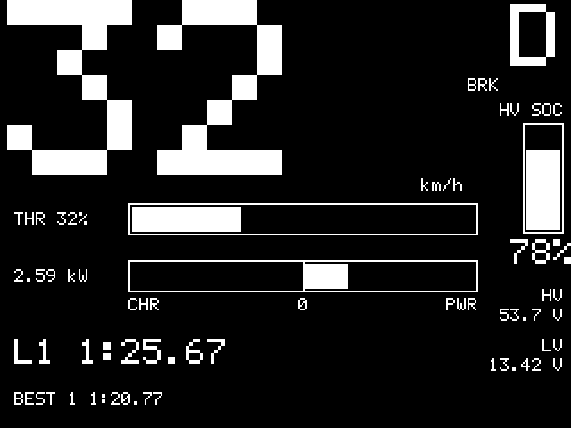

| 위치 | 표시 | 의미 |
| --- | --- | --- |
| 왼쪽 큰 숫자 | WSS 기반 속도 | VCU가 보낸 대표 차량속도, km/h |
| 오른쪽 위 | N / R / D | 현재 기어. 차량에는 P가 없음 |
| 기어 왼쪽 | BRK | 유효한 VCU Brake Active가 ON일 때만 표시 |
| 오른쪽 막대 | HV SOC | BMS BLE에서 받은 고전압 배터리 잔량 |
| 오른쪽 아래 | HV / LV 전압 | 임시 EM Gateway가 보낸 현재 전압 |
| THR | 스로틀 % | VCU가 보낸 유효한 스로틀 전개율 |
| CHR–0–PWR | 전력 | 왼쪽은 충전, 오른쪽은 소비. 숫자는 전력 절댓값 kW |
| L 번호와 시간 | 현재 랩 | 현재 진행 중인 랩 번호와 경과시간 |
| BEST | 최고 랩 | 완료된 랩 중 가장 빠른 기록 |

`BRK`는 압력이나 제동력을 의미하지 않는다. 브레이크 ON/OFF 신호가 켜졌다는 뜻이며 VCU 상태 프레임이 300 ms 이상 오래되면 표시를 지운다.

## 2. 기본 화면에서 터치하기

### 속도 그래프

큰 속도 숫자를 누르면 최근 60초 WSS 그래프가 열린다.

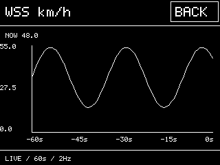

### 전력 그래프

중앙의 CHR–0–PWR 막대를 누르면 최근 60초 전력 그래프가 열린다. 세로축은 전력 절댓값이며 POWER 구간은 실선, CHARGE 구간은 점선이다.

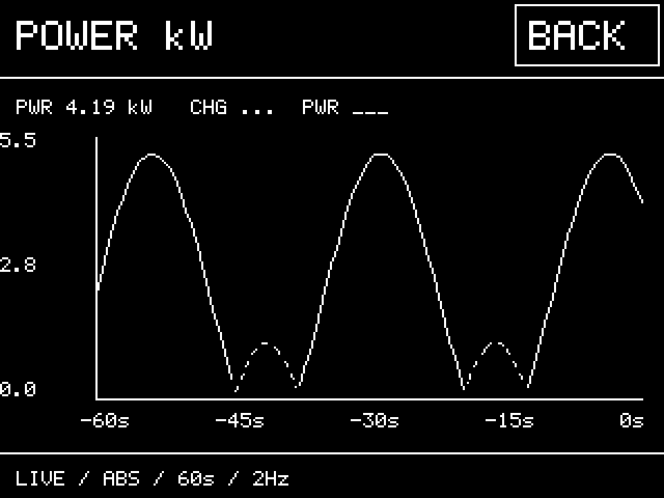

### Car Check 또는 Warning

속도 숫자와 전력 막대를 제외한 기본 화면을 누른다.

- Warning이 없으면 Car Check 메뉴로 이동한다.
- Warning이 있으면 Warning 원인 화면으로 이동한다.
- 세부 화면 오른쪽 위 `BACK`을 누르면 이전 화면으로 돌아간다.
- PCB V3의 GPIO19 순간버튼을 누르면 어느 화면에서나 기본 화면으로 돌아간다. LCD 터치가 불편할 때 사용하는 HOME 버튼이다.

## 3. Car Check 사용법

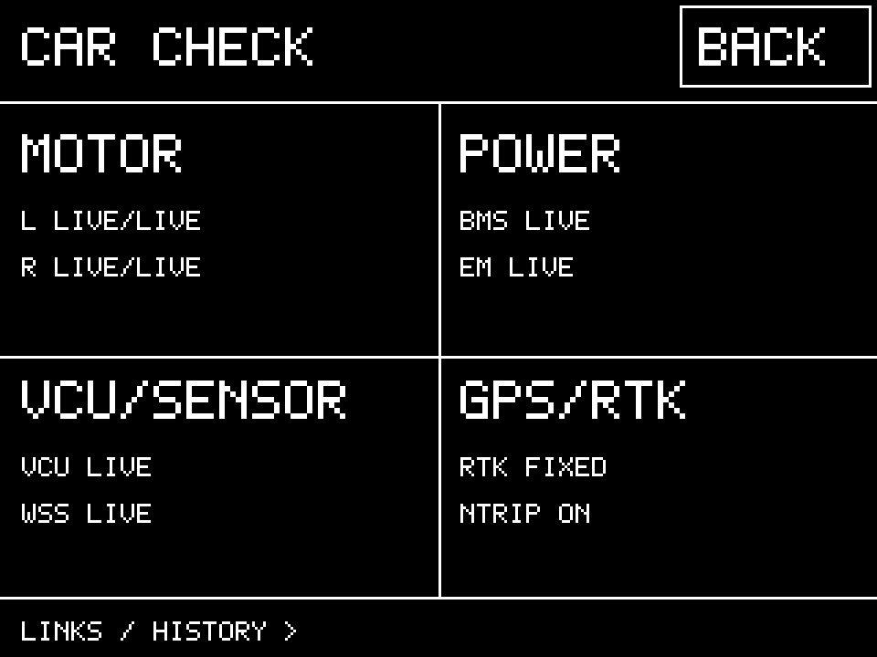

네 영역 중 확인할 항목을 누른다.

| 메뉴 | 확인 가능한 정보 |
| --- | --- |
| MOTOR | 좌/우 버스 전압·버스 전류·상 전류·RPM·온도·상태·고장 |
| POWER | BMS SOC·전압·전류·온도와 EM HV/LV 전압·HV 전류·CPU 온도 |
| VCU/SENSOR | 기어·브레이크 ON/OFF·HV·스로틀·WSS·조향·IMU·4륜 속도·제어 상태·START 입력 |
| GPS/RTK | Fix·RTK·위경도·위성·HDOP·Wi-Fi·NTRIP·RTCM·PPS·랩 상태 |

세부 화면에서 항목 왼쪽에 `*`가 있으면 해당 행을 눌러 최근 60초 그래프를 볼 수 있다.

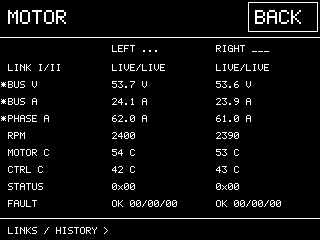

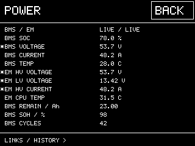

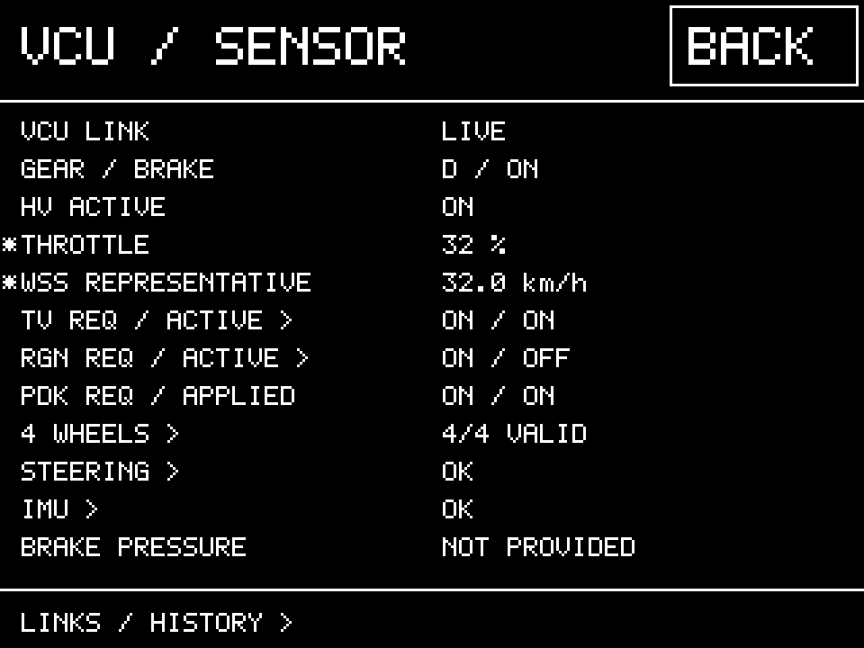

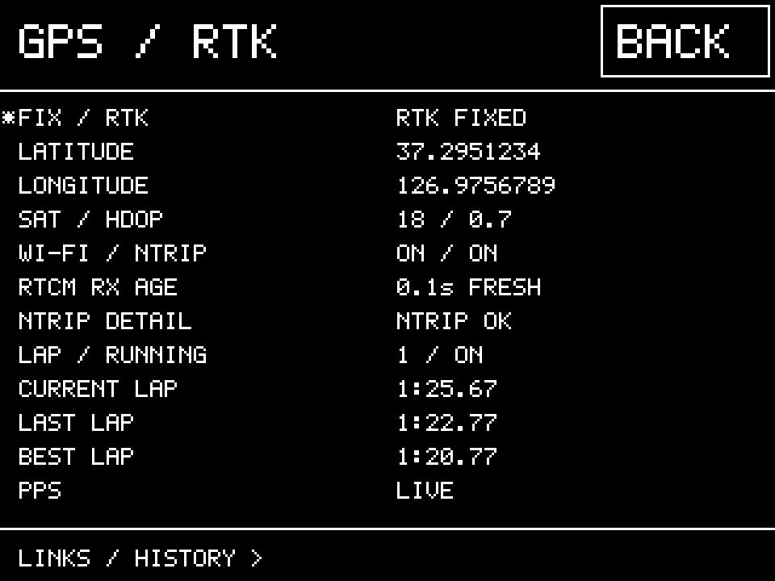

## 4. 연결 상태와 과거 이력

세부 화면 아래의 `LINKS / HISTORY`를 누르면 연결 상태를 확인할 수 있다.

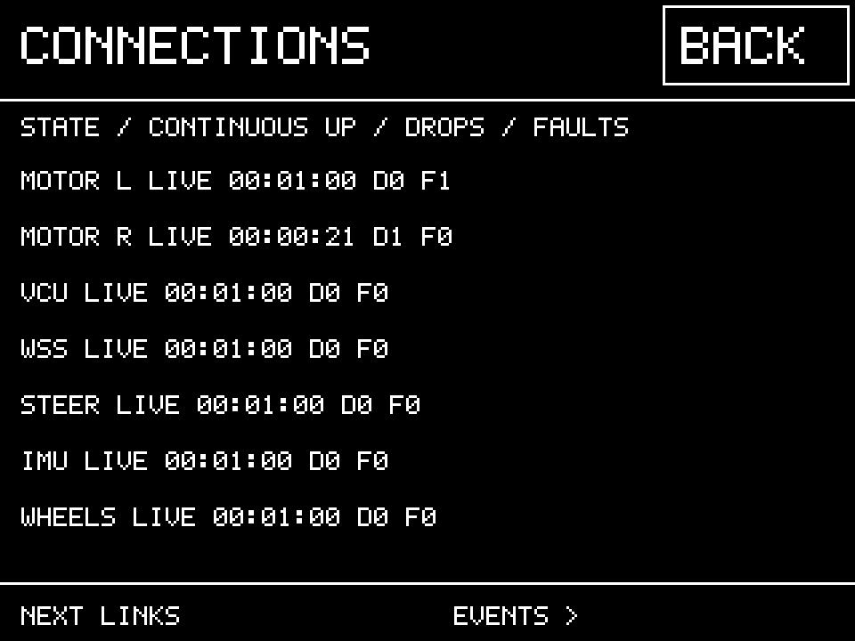

- `LIVE`: 현재 연결됨
- `WAIT`: 부팅 후 아직 유효 프레임을 받지 못함
- `LOST`: 전에 연결됐으나 현재 끊김
- 시간: 현재 연결이 연속 유지된 시간
- `D`: 연결이 끊긴 횟수
- `F`: 새로 발생한 모터 고장 bit 누적 횟수

`EVENTS`에서는 최초 연결, 단절, 복구, 모터 고장 발생과 해제를 최근 32건까지 확인한다.

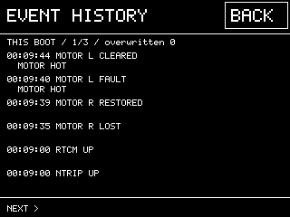

이 이력은 RAM에만 저장되므로 계기판 전원을 끄면 사라진다. 장시간 기록과 사후 분석에는 TMA-1 로그를 사용한다.

## 5. Warning 화면

모터컨트롤러 고장 bit가 발생하면 즉시 붉은 Warning 상태가 된다. 좌·우 모터컨트롤러 피드백 또는 VCU 상태 CAN이 끊기면 순간적인 지연은 무시하고 1초 이상 지속될 때 Warning 상태가 된다. 전원 투입 후 처음 3초는 CAN 시작 유예시간이다.

기존 좌우 모터 RPM으로 다음 구동계 이상 징후도 감시한다.

- `DRIVE RPM WARNING`: 회전 중 한쪽 RPM이 0 부근으로 반복 결손됨
- `DRIVE SYSTEM FAULT`: 좌우 RPM이 큰 비율로 200 ms 이상 발산함
- `LEFT MOTOR` / `RIGHT MOTOR`: 이상이 의심되는 쪽

이 경고는 CAN 패턴에 따른 **구동계 또는 RPM 피드백 이상 경고**이며 특정 부품 파손을 확정하지 않는다. 경고는 운전자가 알아볼 수 있도록 5초간 우선 표시되고, 발생 이력은 재부팅 전까지 유지된다. CAN 수신 중단은 RPM 이상과 별도로 처리한다.

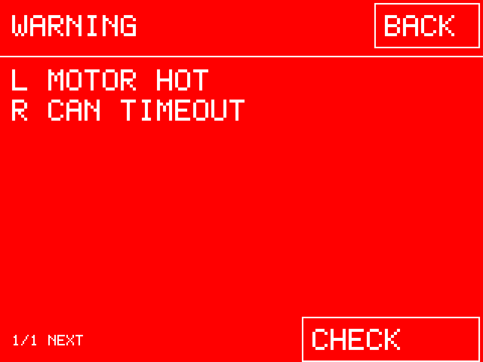

Warning 화면에서 원인을 확인할 수 있다. Warning 중에도 GPS LAP 버튼은 사용할 수 있다. 원인이 사라지면 Warning 화면에서 Car Check 메뉴로 전환된다.

## 6. GPS LAP 버튼

GPS LAP 버튼은 PCB V3 GPIO5에 연결된 순간버튼이다.

| 조작 | 결과 |
| --- | --- |
| 처음 한 번 누름 | 현재 유효 GPS 위치를 Start/Finish 중심점으로 저장하고 `LAP START SET` 표시 |
| 진행 중 한 번 누름 | 현재 랩타이머만 정지하고 `LAP STOPPED` 표시. 기준점과 기록은 유지 |
| 정지 후 한 번 누름 | 기존 랩을 이어서 재개하고 `LAP RESUMED` 표시. 멈춘 시간은 제외 |
| 320 ms 이내 빠른 두 번 누름 | 기준점·가상 결승선·랩 기록을 모두 지우고 `GPS LAP RESET` 표시 |

단일 클릭은 더블클릭 여부를 판별하므로 약 320 ms 뒤 실행된다. GPS 데이터가 없으면 `NO GPS DATA`, 데이터는 있지만 Fix가 없으면 `NO GPS FIX`가 표시된다.

Start/Finish 중심점에서 차량이 출발하면 최근 GPS 이동 방향을 이용해 진행 방향을 구하고, 그 방향에 수직인 좌우 5 m의 가상 결승선을 만든다. 이동 선분이 같은 진행 방향으로 결승선을 통과하면 랩을 완료한다. 시작 직후 화면은 `L1`이며 첫 결승선 통과 후 `L2`로 넘어간다.

## 7. 차량 설정 스위치

| 입력 | 현재 기능 |
| --- | --- |
| Paddock | VCU에 Paddock 제한모드 요청 전송 |
| TC | 토크벡터링 ON/OFF 요청 전송 |
| Regen 로터리 | 0=OFF, 1·2·3=동일 ON 요청 |
| GPIO19 순간버튼 | 계기판 기본 화면으로 복귀 |
| GPS LAP 순간버튼 | 랩 시작·정지·재개·초기화 |
| GPIO4 | VESS PWM 출력. 버튼 입력이 아님 |
| GPIO34 START_IN | 30 kΩ/10 kΩ 분압을 거친 START 상태 감시. 차량 제어에는 사용하지 않음 |

스위치의 요청 상태와 VCU가 실제로 적용한 상태는 다를 수 있다. Car Check의 CONTROL 화면에서 요청 수신, 실제 Active, 차단 이유를 함께 확인한다.

## 8. 표시가 이상할 때

| 표시 | 확인할 내용 |
| --- | --- |
| `-- WAIT` | 해당 CAN/BLE/GPS 프레임을 아직 받지 못했거나 timeout 발생 |
| `STALE` | 예전 값은 있으나 최신 수신 시간이 허용 범위를 넘음 |
| `INVALID` | 송신 ECU가 값이 유효하지 않다고 표시함 |
| `UNKNOWN` | 구버전 프레임 등으로 유효성 정의를 확인할 수 없음 |
| `BRK`가 안 뜸 | 브레이크가 OFF이거나 VCU 상태 프레임이 오래됨 |
| LV %가 없음 | 현재 LV SOC 데이터가 없으며 전압만 수신 가능 |
| 그래프의 선이 끊김 | 그 시간 구간의 데이터가 유효하지 않거나 연결이 끊김 |

화면은 20 Hz 갱신을 목표로 하지만 새로운 측정값의 속도는 각 CAN·BLE·GNSS 원천 주기에 의해 결정된다. 그래프는 2 Hz, 최근 60초 추세 확인용이며 정밀 분석용 원본 로그가 아니다.

## 9. 현재 사용상 주의

- HV/LV와 전력은 임시 EM Gateway 데이터에 의존하며 대회 공식 에너지 판정값이 아니다.
- 충전/방전 방향은 실차에서 전류 부호를 확인해야 한다.
- LV SOC와 브레이크 압력은 현재 표시할 수 없다.
- Steering은 정규화 값이며 실제 조향각으로 확정되지 않았다.
- IMU 축과 부호, 개별 WSS 보정은 차량 장착 상태에서 검증해야 한다.
- 연결/고장 이력은 전원을 끄면 초기화된다.
- START 화면 전압은 GPIO34에서 측정한 분압 후 ADC 전압이며, 원래 9~12 V 입력 전압이 아니다.
- 구동계 이상 감지는 초기 임계값 기반의 운전자 경고 기능이다. 실제 토크 제한이나 차단은 수행하지 않는다.
